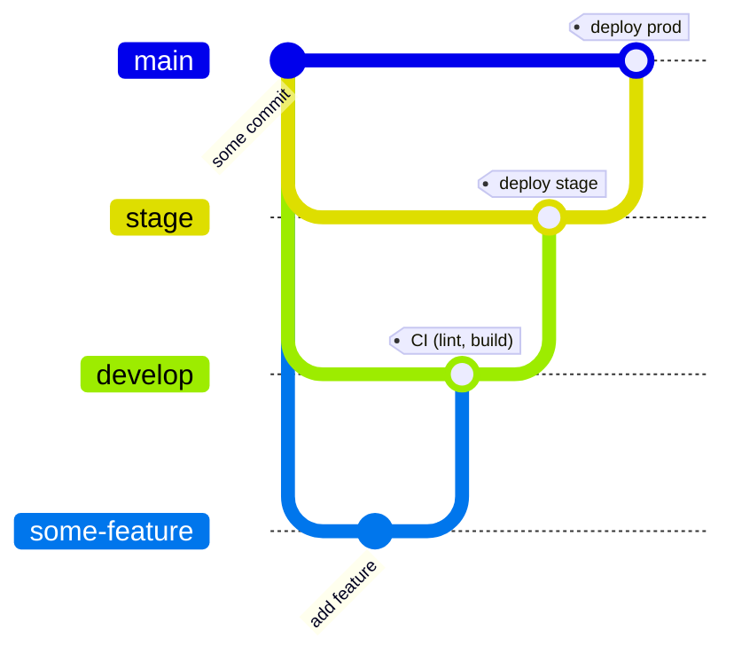

# Django Doge App

[](https://github.com/martibosch/django-doge-app/actions/workflows/ci.yml)
[](https://github.com/martibosch/django-doge-app/actions/workflows/deploy.yml?query=branch%3Amain)
[](https://github.com/martibosch/django-doge-app/blob/main/LICENSE)
[](https://github.com/martibosch/cookiecutter-django-doge)

Example Django app using the Doge workflow

This setup is based on [cookiecutter-django](https://github.com/cookiecutter/cookiecutter-django). See [its documentation](https://cookiecutter-django.readthedocs.io/en/latest) for more information.

## Requirements

### Software

* [GNU Make](https://www.gnu.org/software/make/)
* [terraform](https://www.terraform.io/)
* [git](https://git-scm.com/) >=2.28.0
* [pre-commit](https://pre-commit.com/)

Optional (recommended):

* [GitHub CLI](https://cli.github.com/) (if you want to create the GitHub repository from the terminal).

### Accounts

* A DigitalOcean account. You can sign up using [my referral link](https://m.do.co/c/fcde1e9e1f62) to get $100 in credit.
* A GitHub account.
* A Terraform Cloud account and a Terraform Cloud organization. With an active account, you can create an organization by navigating to [app.terraform.io/app/organizations/new](https://app.terraform.io/app/organizations/new). You can also use an existing organization. This workflow is compatible with [the free plan](https://www.terraform.io/cloud-docs/overview).

### Domain

* A domain name, which can be from any domain registrar, but must point to the DigitalOcean nameservers. The latter can be achieved following the instructions [docs.digitalocean.com/tutorials/dns-registrars](https://docs.digitalocean.com/tutorials/dns-registrars).

## Steps

:warning: **Note**: it is very important that the steps are followed **in the order** outlined below:

### 1. Create access tokens (or use existing ones)

The cookiecutter-django-doge :dog2: workflow requires the following access tokens, which can be created as listed below - alternatively, existing tokens may be used:

* **DigitalOcean**:
  * **API token**: navigate to [cloud.digitalocean.com/account/api/token/new](https://cloud.digitalocean.com/account/api/tokens/new) (you must be authenticated), choose a name and an expiration, click on "Generate Token" and copy the generated token as the value of the `do_token` variable.
  * **Spaces access keys**: navigate to [cloud.digitalocean.com/account/api](https://cloud.digitalocean.com/account/api), scroll down to the "Spaces access keys" section, click on "Generate New Key", provide an informative name and copy the generated key and secret as the values of the `do_spaces_access_id` and `do_spaces_secret_key` respectively.
* **GitHub**: navigate to [github.com/settings/tokens/new](https://github.com/settings/tokens/new) (you must be authenticated), choose a name, an expiration and select at least the `repo`, `read:org` and `read:discussion` permissions (and `delete_repo` if you want to be able to delete the repository from Terraform). Click on "Generate token" and copy the generated token as the value of the `gh_token` variable.
* **Terraform Cloud**: navigate to [app.terraform.io/app/settings/tokens](https://app.terraform.io/app/settings/tokens) and click on "Create an API token", provide a description, click on "Create API token" and copy the generated token as the value of the `tf_api_token` variable.

The access tokens (generated or exising) must be set in the `terraform/deploy/meta/vars.tfvars` and `terraform/deploy/dotenv/vars.tfvars` (as terraform variables), as well as in `.envs/.production/.django` (environment variables) as follows:

```
# terraform/deploy/meta/vars.tfvars

...
# tokens
do_token             = "<token-contents>"  # DigitalOcean API token
do_spaces_access_id  = "<token-contents>"  # DigitalOcean spaces access key ID
do_spaces_secret_key = "<token-contents>"  # DigitalOcean spaces secret key
gh_token             = "<token-contents>"  # GitHub personal access token
tf_api_token         = "<token-contents>"  # Terraform Cloud API token
```

```
# terraform/deploy/dotenv/vars.tfvars

...
# tokens
tf_api_token         = "<token-contents>"  # Terraform Cloud API token
```

```
# .envs/.production/.django
# there is no need to use quotes here (unless the values contain whitespaces)
DJANGO_AWS_ACCESS_KEY_ID=<token-contents>  # DigitalOcean spaces access key ID
DJANGO_AWS_SECRET_ACCESS_KEY=<token-contents>  # DigitalOcean spaces secret key ID
```

:warning: **Note**: in order to avoid disclosing sensitive information, these files *are kept out of version control*.

### 2. Initial infrastructure provisioning

The initial infrastructure provisioning in the cookiecutter-django-doge workflow is done by running Terraform locally with the help of GNU Make. This will set up the required GitHub infrastructure (notably [repository secrets](https://docs.github.com/en/actions/security-guides/encrypted-secrets)) so that the rest of the workflow is fully managed by GitHub Actions.

:warning: **Note**: the initial infrastructure provisioning is only done once.

#### 2.1 Bootstraping Terraform Cloud workspaces

From the root of the generated project, use the following command to provision the meta workspace (i.e., a workspace to manage workspaces<sup>[1](#managing-workspaces-scale-factory), [2](#bootstraping-workspaces)):

```bash
make init-meta
```

At this point, if you navigate to [app.terraform.io/app/exaf-epfl/workspaces](https://app.terraform.io/app/exaf-epfl/workspaces), a workspace named `django-doge-app-meta` should appear.

You can then plan and apply the Terraform setup as follows:

```bash
make plan-meta
make apply-meta
```

which will create four additional workspaces, named `django-doge-app-base`, `django-doge-app-dotenv`, `django-doge-app-stage` and `django-doge-app-prod`.

#### 2.2 GitHub repository and base infrastructure

The GitHub repository can be created in two ways:

* *using the [GitHub CLI](https://cli.github.com/)* (*recommended*): first, make sure that you are properly authenticated with the GitHub CLI (use the [`gh auth login`](https://cli.github.com/manual/gh_auth_login) command). Then, from the root of the generated project, run:

    ```bash
	make create-repo
	```

	which will automatically initialize a git repository locally, add the first commit, and push it to a GitHub repository at `martibosch/django-doge-app`.

* *manually from the GitHub web interface*: navigate to [github.com/new](https://github.com/new), create a new empty repository at `martibosch/django-doge-app`. Then, from the root of the generated project, initialize a git repository, setup pre-commit for the repository, add the first commit and push it to the new GitHub repository as follows:

	```bash
	git init --initial-branch=main  # this only works for git >= 2.28.0
	pre-commit install
	git add .
	SKIP=terraform_validate git commit -m "first commit"
	git branch -M main
	git remote add origin git@github.com:martibosch/django-doge-app
	git push -u origin main
	```

Once the initial commit has been pushed to GitHub, use GNU Make to provision some base infrastructure:

```bash
make init-base
make plan-base
make apply-base
```

notably, a ssh key will be created and added to terraform, DigitalOcean (you can see a new item named `django-doge-app` at [cloud.digitalocean.com/account/security](https://cloud.digitalocean.com/account/security), and [repository secrets](https://docs.github.com/en/actions/security-guides/encrypted-secrets#creating-encrypted-secrets-for-a-repository) (you can see a repository secret named `SSH_KEY` at [github.com/martibosch/django-doge-app/settings/secrets/actions](https://github.com/martibosch/django-doge-app/settings/secrets/actions)). Additionally, a DigitalOcean project (an item named `django-doge-app` visible in the top-left "PROJECTS" menu of the web interface) will be created to group the resources used for this app.

#### 2.3 Dotenv files

The docker-compose setup uses a set of environment variables for each environment (local, staging and production) defined in the `.envs` directory, whose files are provisioned by Terraform as repository secrets (file contents encoded as base64 strings) so that they can be used in GitHub Actions. This is done in the `django-doge-app-dotenv` workspace, which unlike the other workspaces, is executed locally so that it can read the contents of the `.envs/.staging` and `.envs/.production` directories, which as noted above, are kept outside version control to prevent disclosing sensitive information. The provisioning is also be done using GNU Make following the Terraform init-plan-apply scheme:

```bash
make init-dotenv
make plan-dotenv
make apply-dotenv
```

Once the above commands are executed, a map of the `.env` files and their base64-encoded contents will be defined as the `env_file_map` workspace variable in both the staging and production workspaces, i.e., [app.terraform.io/app/exaf-epfl/workspaces/django-doge-app-stage/variables](https://app.terraform.io/app/exaf-epfl/workspaces/django-doge-app-stage/variables) and [app.terraform.io/app/exaf-epfl/workspaces/django-doge-app-prod/variables](https://app.terraform.io/app/exaf-epfl/workspaces/django-doge-app-prod/variables) respectively.

#### 2.4 Staging and production infrastructure

The inital provisioning of the staging and production infrastructure must also be done using GNU Make following the Terraform init-plan-apply scheme, i.e., for the staging environment:

```bash
make init-stage
make plan-stage
make apply-stage
```

and for production:

```bash
make init-prod
make plan-prod
make apply-prod
```

If you navigate to [cloud.digitalocean.com](https://cloud.digitalocean.com) and select the `django-doge-app` project, you will see that droplets named `django-doge-app-stage` and `django-doge-app-prod` have been created for each environment respectively. Additionally, at [github.com/martibosch/django-doge-app/settings/secrets/actions](https://github.com/martibosch/django-doge-app/settings/secrets/actions)), you will find the following [environment secrets](https://docs.github.com/en/actions/security-guides/encrypted-secrets#creating-encrypted-secrets-for-an-environment):

* `DROPLET_HOST`: IPv4 address of the staging and production hosts respectively.
* `PROD_DJANGO`, `PROD_POSTGRES` and `PROD_TRAEFIK`: base64-encoded strings with the contents of the files at `.envs/.production`, which will be set for both the `stage` and `prod` environments.
* `STAGE_DJANGO` and `STAGE_TRAEFIK`: base64-encoded strings with the contents of the files at `.envs/.staging`, which will be set for the `stage` environment only.

### 3. GitOps workflow for CI/CD

Once the initial infrastructure has been provisioned, CI/CD is ensured by the following GitOps workflow:

1. New features are pushed into a dedicated feature branch.
2. **develop**: a pull request (PR) to the `develop` branch is created, at which point [CI workflow](https://github.com/martibosch/django-doge-app/blob/main/.github/workflows/ci.yml) is run. If the CI workflow passes, the PR is merged, otherwise, fixes are provided in the feature branch until the CI workflow passes.
3. **stage**: once one or more feature PR are merged into the `develop` branch, they can be deployed to the staging environment by creating a PR to the `stage` branch, which will trigger the ["plan" workflow](https://github.com/martibosch/django-doge-app/blob/main/.github/workflows/plan.yml). If successful, the PR is merged, at which point the ["deploy" workflow](https://github.com/martibosch/django-doge-app/blob/main/.github/workflows/deploy.yml) is run, which will deploy the branch contents to the staging environment.
4. **main**: after a successful deployment to staging, a PR from the stage to the main branch will trigger the ["plan" workflow](https://github.com/martibosch/django-doge-app/blob/main/.github/workflows/plan.yml), yet this time for the production environment. Likewise, If the workflow passes, the PR can be merged, which will trigger the ["deploy" workflow](https://github.com/martibosch/django-doge-app/blob/main/.github/workflows/deploy.yml), which will deploy the branch contents to production.

Overall, the Doge :dog2: GitOps workflow can be represented as follows:



## Destroying infrastructure

The infrastructure provisioned by this setup can be destroyed using GNU Make as follows:

```bash
make destroy-prod
make destroy-stage
make destroy-dotenv
make destroy-base
make destroy-meta
```

## Footnotes

<a name="managing-workspaces-scale-factory">1</a>. ["Managing Workspaces With the TFE Provider at Scale Factory"](https://www.hashicorp.com/resources/managing-workspaces-with-the-tfe-provider-at-scale-factory)

<a name="managing-workspaces-scale-factory">2</a>. [response by chrisarcand in "Using variables with remote backend"](https://discuss.hashicorp.com/t/using-variables-with-remote-backend/24531/2)
